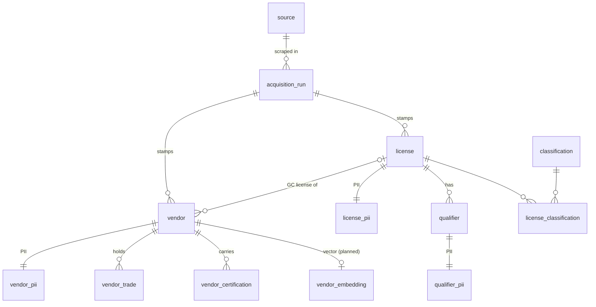

# VendorScope

**Vendor readiness & availability analytics.** VendorScope turns fragmented public vendor and licensing data into an audited, decision-ready view of who is registered, licensed, available, and ready for public-sector procurement, built on a documented and reusable data-quality pipeline.

[](https://github.com/wolfieman/vendor-scope/actions/workflows/ci.yml)


---

## TL;DR: flagship case study (Fayetteville PWC)

VendorScope's first real-world application. The **Fayetteville Public Works Commission (PWC)**, a municipal power & water utility, needed
to understand its contractor/vendor base for supply-chain planning and economic-inclusion goals,
but the vendor data was incomplete and unverified. I assembled the data from two public sources,
built a documented cleaning-and-audit pipeline, and produced descriptive analytics across **295 vendors**.

**Headline results:**

- **65.4%** of vendors (193 of 295) had **missing HUB (Historically Underutilized Business) status**, the single biggest data-quality gap.
- Of vendors with known status, **80 are HUB-certified** and **22 are explicitly not certified**.
- **Recommendation:** prioritize outreach to the **22 non-HUB-certified vendors** for economic-inclusion conversations, and close the HUB-status gap at vendor intake.


▶️ **[Watch the video overview](assets/unlocking-opportunity.mp4)** (≈3 min).

---

## Business context

PWC works with hundreds of contractors but lacked a single, trustworthy view of *who* its vendors
are, *what they're licensed to do*, and *which qualify for economic-inclusion programs*. The source
records were spread across systems, inconsistently formatted, and full of gaps, which made any
downstream analytics unreliable. The goal: a clean, auditable vendor source-of-truth plus a
**reusable data-quality protocol** that PWC could keep applying.

## Data

Two public sources, **295 records each** in the Part-1 study (the live sources have
since grown; the rebuilt pipeline re-acquires fresh). Raw files contain contact PII
and are **never committed**. The Part-1 anonymized sample and data dictionary were
retired with the original pipeline (both live in git history); the rebuilt pipeline
regenerates them, per [`docs/project-plan.md`](docs/project-plan.md):

| Dataset | Source | Shape | Contents |
|---|---|---|---|
| Vendor master | NC electronic Vendor Portal (eVP, `evp.nc.gov`) | 295 × 44 | vendor identity, HUB/cert status, per-trade licenses |
| License details | NC Licensing Board for General Contractors (NCLBGC, `nclbgc.org`) | 295 × 12 | license status, limitation, classifications, qualifier |

## Methodology

```text
Acquisition  →  Cleaning  →  Profiling  →  Audit  →  Descriptive analytics
(Selenium /     (protocol     (per-column   (missingness   (HUB, licensing,
 Playwright)     standardize)   stats)        report)        geography)
```

1. **Acquisition**: scraped NCLBGC license details and resolved license numbers by
   company name (browser automation), merged with the eVP vendor/HUB export.
2. **Cleaning** applied a documented protocol: trim whitespace, lowercase emails,
   format phones `###-###-####`, hybrid-case business names with standardized
   legal suffixes, dates `MM/DD/YYYY`, license numbers and ZIPs stored as **text**
   (leading zeros preserved), de-duplication on vendor name + license number, and
   cross-validation of every vendor license against the NCLBGC source.
3. **Profiling**: per-column counts, missingness, and basic stats.
4. **Audit**: a Markdown data-quality report ranking columns by missingness.
5. **Analytics**: descriptive analysis (HUB distribution, license levels, geography) delivered as
   an infographic and a video overview.

## Key findings (verified against the data)

**HUB certification: a major data gap**

| HUB status | Vendors | Share |
|---|--:|--:|
| Certified | 80 | 27.1% |
| Not certified | 22 | 7.5% |
| **Missing** | **193** | **65.4%** |

Among HUB-certified vendors, the largest categories were Female-owned (43) and Black-owned (23);
`HUB_Category` was itself missing for 215 vendors (72.9%), limiting demographic analysis.

**Licensing posture (all 295 license records)**

| License limitation | Vendors | | Electrical level\* | Vendors |
|---|--:|---|---|--:|
| Unlimited | 206 (69.8%) | | Unlimited | 11 |
| Limited | 82 (27.8%) | | Limited | 6 |
| Intermediate | 7 (2.4%) | | Intermediate | 1 |

License status: **263 active**, 23 invalid, 9 archived. *\*Among the 18 vendors holding an electrical license.*

📄 Full breakdown in [`reports/findings-summary.md`](reports/findings-summary.md); pipeline details in [`reports/methodology.md`](reports/methodology.md).

## Recommendation

1. **Contact the 22 non-HUB-certified vendors**, a small, actionable list for economic-inclusion outreach.
2. **Close the HUB-status gap** (193 missing) by capturing certification at vendor intake.
3. **Adopt the cleaning protocol** as the standing data-quality standard for vendor onboarding.

## Repository structure

```text
.
├─ src/vendorscope/     # the installable package (rebuilt slice by slice)
├─ tests/               # pytest suite (unit / contract / integration markers)
├─ data/                # raw + processed (gitignored, PII); sample + dictionary regenerate in the eVP slice
├─ docs/                # project plan · cleaning protocol · master-data reference
├─ reports/             # published Part-1 analysis
├─ assets/              # infographic + video overview (video via Git LFS)
├─ pyproject.toml       # dependencies + tooling config (uv project)
└─ uv.lock              # pinned, reproducible environment
```

## Database (planned)

A later slice turns the pipeline into a maintained data product: a **single SQLite
file** holding the normalized relational tables *and* the embedding vectors (via
[`sqlite-vec`](https://github.com/asg017/sqlite-vec)). STRICT tables, enforced foreign
keys, `CHECK`-constraint vocabularies, and PII quarantined into `*_pii` sibling tables so
the public export is PII-free by construction. Design reference:
[`docs/database-schema.md`](docs/database-schema.md); the build lands per
[`docs/project-plan.md`](docs/project-plan.md).



## Reproduce

The pipeline is being rebuilt from a clean slate (2026-06) and lands in gated
slices; the original flat-file pipeline and its anonymized sample have been
retired. Until the rebuilt pipeline ships a new sample, the published Part-1
analysis is documented in [`reports/`](reports/). The plan, slice backlog, and
gates: [`docs/project-plan.md`](docs/project-plan.md).

## Tech stack

**Python 3.14** · pandas · httpx · pytest · ruff · pyright · **uv** (environment &
locking). Part-1 analytics were produced with SAS Viya + Excel.

## Development

Engineering standards, project layout, the toolchain, and how to run the tests and
pipeline are documented in [`CONTRIBUTING.md`](CONTRIBUTING.md).

## License & contact

Source-available under the **PolyForm Noncommercial License 1.0.0** (see [`LICENSE`](LICENSE)),
free to view, study, and share for non-commercial purposes.

**Wolfgang Sanyer** · [wolfgang.sanyer@gmail.com](mailto:wolfgang.sanyer@gmail.com)
